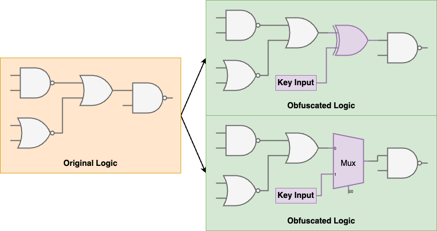
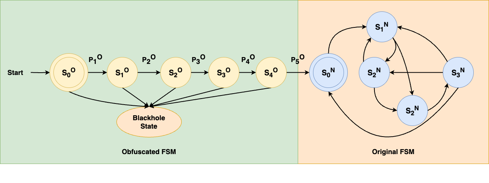

# ENGR 399/599 Lab 2: Obfuscation
Adapted from Swarup Bhunia at the University of Florida. v2024.0

<span style="color:red">Due: 11:59pm, Monday Mar. 10, 2024</span>

## Overview

In this lab you will implement different hardware obfuscation techniques for securing hardware intellectual properties (IPs) against piracy, tampering attacks, and overproduction.

## Setup

```bash
$ git clone https://github.com/ENGR599/p2-obfuscation.git
$ cd p2-obfuscation
$ make
$ make BITSTREAM_PATH=part1_bitstreams/group<#>.bit flash
```

## Lab

### Part 1: Brute Forcing an Obfuscated Circuit

1. Each group is given a different bitstream implementing combinational circuit obfuscation.

	- The provided bitstream will show 4 blinking LEDs on pins LD0 (U16), LD1 (E19), LD2 (U19), LD3 (V19) on the Basys3 board.
	- The underlying design is obfuscated within the combinational logic - it will only function correctly when supplied with the correct key input.

Your group's bitstreams can be found in the 'part1_bitstreams' folder from the above starter code:

```bash
$ ls part1_bistreams/
```

2. Program the Basys3 board with the appropriate bitstream for your group through the Vivado hardware manager or using the Makefile.
3. The key is set by toggling eight different DIP switches on the board (SW7-SW0). These switches represent 1-bit in an 8-bit vector for the key input.

| Key Bit | 7 | 6 | 5 | 4 | 3 | 2 | 1 | 0 |
| --- | --- | --- | --- | --- | --- | --- | --- | --- |
| Switch | SW7 | SW6 | SW5 | SW4 | SW3 | SW2 | SW1 | SW0 |

4. In `python/uart.py`, there is a starter python script which sends a UART byte. The script will need to be updated with the correct USB device before a key byte can be sent to the Basys3. For quicker brute forcing, write the program to send all possible bytes.

```bash
$ python3 python/uart.py
```

5. One way to attack combinational obfuscation is to simply try enough keys until we observe the circuit functions correctly.
	- Carry out a brute-force attack on the obfuscated circuit by using the python script. 
    - Record the correct key for your report below
    | Group # | Key |
    | ------- | --- |
    |         |     |

6. Observe how long it took (approximately) to find an 8-bit key. Calculate how long it would take to test a 256-bit key. Do you think it would be possible to test that many keys through a brute-force attack? Record your calculations and answer to the previous question in your report.

### Part 2: Design a Circuit with Combinational Obfuscation.

1. In this section you will extend the provided `part2.sv` circuit with additional combinational obfuscation. You can access part 2 of the project with the below code.

```bash
$ vivado vivado_part2/vivado_part2.xpr
```

2. You need to make the `part2.sv` circuit dependent on the key inputs given to it by the switches on the Basys3 board. One way to do this is to XOR or XNOR bits of the key with signals used in circuit.



3. For example, one way to incorporate key material into the functionality of `parts.sv` is to XNOR a bit of the key with "on" signal. In the example shown below we XNOR the transition of the "on" signal with the first bit of the key. The result is that the circuit will only function correctly if `key[0]` is high.

```verilog
always @(*) begin
	if (delay == 25'hFFFFFFF) begin
		on = ~on ~^ key[0];
	end
end
```

| Key Input | X | XOR Gate Y | XNOR Gate Y |
| --------- | --- | -------- | ----------- |
| 0 | 0 | 0 | 1 |
| 0 | 1 | 1 | 0 |
| 1 | 0 | 1 | 0 |
| 1 | 1 | 0 | 1 | 

4. Incorporate all 8 bits of the key vector input into your code such that the circuit will correctly pulse the LEDs when all 8 bits of the key are set correctly, using XOR and XNOR. *You may change the circuit or extend it with additional signals to accomplish this task.*

### Part 3: Design a Circuit with Sequential Obfuscation

The state machine of an integrated circuit (IC) can be obfuscated to 'lock' the design. In regular state machine design, usually not all possible states are in operation. These are often states that never occur, or are not reachable.

These states can be used to introduce additional locking mechanisms into the design. Another way to obfuscate the state machine is hiding the startup state. Designers can add an extra state machine before the actual desired state machine which will make the access to the initial state of the original state reachable for only a specific input sequence.

```bash
$ vivado vivado_part3/vivado_part3.xpr
```

1. Access the part 3 project with the above command. Update the provided `part3.sv` verilog module in the Vivado project. This file implements a state machine that increments the 7-segment LED display on the Basys3 board form 0 to 9. Extend the states to sequentially obfuscate the startup state iwth 8 additional states (one state for each bit of the key).


2. To accomplish this task you will need to add additional states to the provided state machine. The 7-segement LED counter should only function properly once the initial obfuscated states have successfully passed.
	- User will input a key using the S7...S0 DIP switches on the board.
	- Each state validates a bit of the key, before progressing to the next state. The circuit will function properly if each obfuscated state receives the correct key.
	- If a state detects the incorrect bit, the state machine should transition to a "black hole" state that cannot be escaped from without reprogramming the bitstream.



3. Submit your extended `part3.sv`, along with what 8-bit key you used to obfuscate the state-machine.

## What to Turn In

***Please upload a zipped folder to Canvas containing the following:***

- A report containing your brute forced key & short answer from parts 1.4 and 1.5.
- Extended `part2.sv` source code from part 2.5 and the key used to obfuscate the design in the report.
- Extended `part3.sv` source code from part 3.4 and the key used to obfuscate the design in the report.

